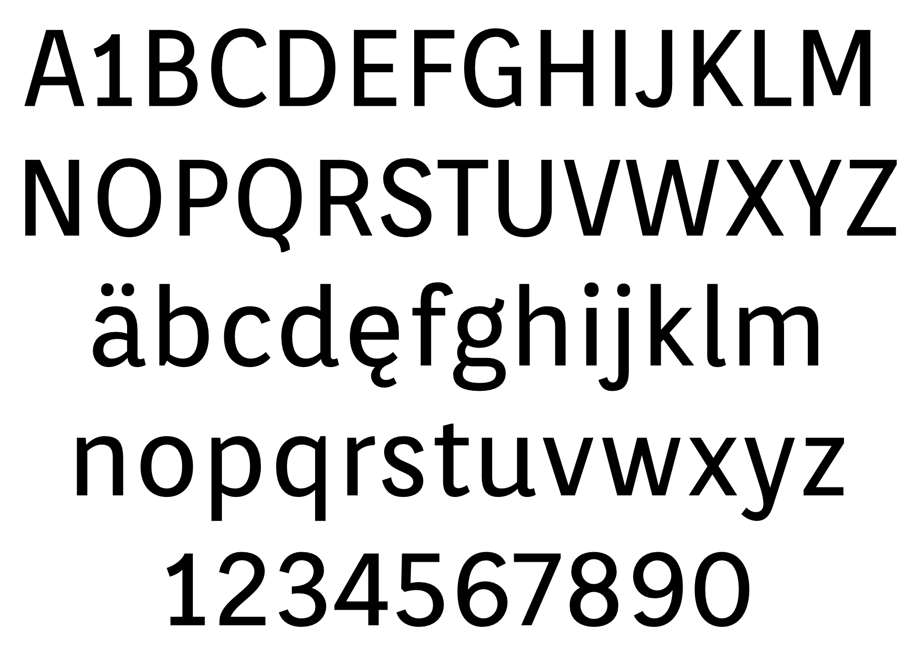

### Orienta

Orienta is a spacious sans serif, with excellent visual performance at very small text sizes. The balance between forms and counterforms creates strong legibility. If used in titles, you can see the details are all carefully designed, especially in the strokes of each letter.

### Designer

* Eduardo Rodríguez Tunni

### License

Licensed under the [*SIL Open Font License, 1.1*](http://scripts.sil.org/OFL); you may not use this file except in compliance with the License.

To contribute to the project contact Eduardo Rodríguez Tunni > edu@tipo.net.ar
